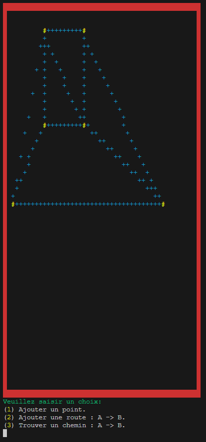

# MAPS

Le projet **Maps** permet de créer une carte en ASCII art, similaire à Google Maps. Il offre la possibilité de visualiser des routes, des points (villes) et de tracer des itinéraires.

## Fonctionnalités

- **Créer ou supprimer des points** : Représentés par le caractère `#`.
- **Créer des routes** : Représentées par le caractère `+` entre les points existants.
- **Trouver l'itinéraire le plus court** : Représenté par le caractère `█` entre un point A et un point B.

## Installation

Clonez le dépôt avec la commande suivante :

bash
``git clone https://github.com/RYUJINC/MAPS.git``

## Utilisation
Voici les options disponibles dans l'interface :

- **Ajouter un point.**
- **Ajouter une route** : A -> B.
- **Trouver un chemin** : A -> B.

**Exemples**
- **Ajout d'un point** : sélectionnez l'option 1.
- **Création d'une route** : sélectionnez l'option 2, puis spécifiez les points A et B.
- **Recherche d'un itinéraire** : sélectionnez l'option 3, puis spécifiez les points A et B.
  

## Contribution
Actuellement, les contributions ne sont pas acceptées.

## Licence
Licence MIT

## Contact
Pour toute question, veuillez nous contacter via le serveur discord suivant : [KALIX](https://discord.gg/Dmh6wHaKvD).
